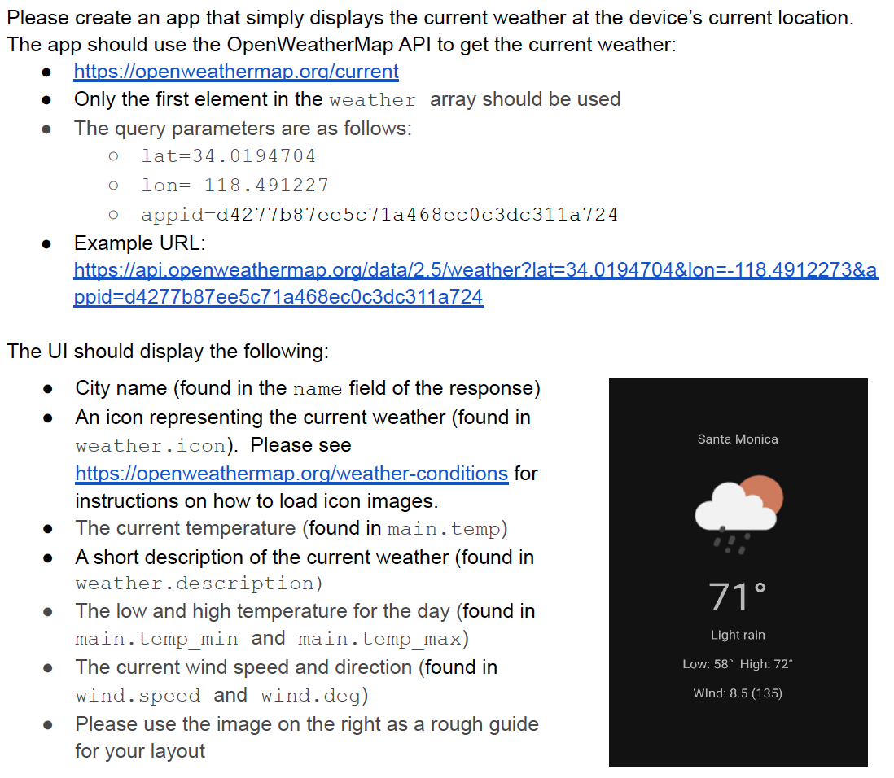
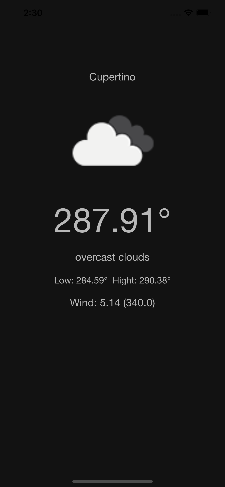

# WeatherApp
This project shows an example of a clean architecture and best practices to create an app

The following image shows the requirements:

# Requirements:
- Xcode 13.3
- CocoaPods
- CocoaKeys
- iOS 15.4 or higher

# Instructions to run the project
- Clone the project
- Open the terminal in the root of the project
- Execute pod install, this will request the OpenWeatherAPI, if you don't have it you can request it [here](https://openweathermap.org/current)

# External libraries
The project uses the following external libraries:
- [Alamofire](https://github.com/Alamofire/Alamofire)
- [Mocker](https://github.com/WeTransfer/Mocker)
- [SDWebImage](https://github.com/SDWebImage/SDWebImage)
- [SDWebImageMockPlugin](https://github.com/faberNovel/SDWebImageMockPlugin)

# Improvements to do
- Add localization to the app
- Handle units in the app for the different values like temperature, this can be do it using the region of the device. The endpoints allow to specify the unit wished in the request
- Add lanscape orientation

# Current UI
